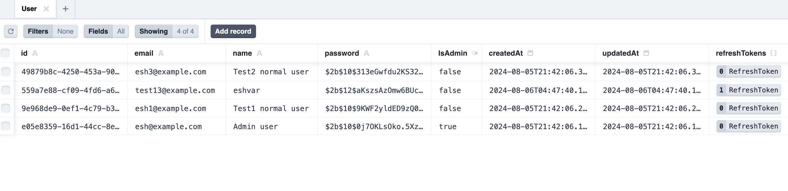

# RESTful Express App

This is a simple RESTful API built using Express.

## Table of Contents

- [Installation](#installation)
  - [Prerequisites](#prerequisites)
  - [Go to 'backend' directory](#go-to-backend-directory)
  - [Install dependencies](#install-dependencies)
  - [Set up the Database (SQLite)](#set-up-the-database-sqlite)
    - [Migrate Prisma ORM](#migrate-prisma-orm)
    - [Generate Prisma Client](#generate-prisma-client)
    - [Seed the Database (Optional)](#seed-the-database-optional)
    - [See the Database with Prisma Studio (Optional)](#see-the-database-with-prisma-studio-optional)
  - [Start the Server](#start-the-server)
  - [API Endpoints](#api-endpoints)
  - [Unit tests](#unit-tests)

## Installation

### Prerequisites

- Node.js (v20.10.0 or higher)
- npm
- clone the repository

> if you haven't cloned the repository yet, follow the instructions from the main [README.md](../README.md#clone-the-repository).

### Go to 'backend' directory

This is the backend directory, where the Express app is located.

```bash
cd backend
```

### Install dependencies

> It may take a few minutes to install all the dependencies.

```bash
npm install
```

### Set up the Database (SQLite)

In this project, SQLite is used as the database. It is a file-based database, so you don't need to set up a separate database server. Prisma ORM is used to manage the database schema and migrations.

#### Migrate Prisma ORM

1. Run the following command to create the initial migration and generate the SQLite database file:

```bash
npx prisma migrate dev --name init
```

#### Generate Prisma Client

```bash
npx prisma generate
```

#### Seed the Database (Optional)

If you want to seed the database with some users, you can run the following command:

```bash
npm run seed
```

Output:

```bash
> backend@1.0.0 seed
> ts-node src/lib/seed.ts

Start seeding ...
Created user with id: 9c187e3b-54de-4f1e-8400-b8f0c8a36851
Created user with id: fa1245af-5720-4fe7-8cdf-4d6810663876
Created user with id: 3f61838a-d0c8-44df-8c89-33d0523e5c9e
Seeding finished.
```

This is how database looks like after seeding:



It will create a few users in the database. You can check the [`seed.ts`](src/lib/seed.ts) file for more details.

##### See the Database with Prisma Studio (Optional)

You can use Prisma Studio to view and manage the database. Run the following command to start Prisma Studio:

```bash
npx prisma studio
```

#### Start the Server

```bash
npm run dev
```

Express app should now be running and connected to the SQLite database.

## API Endpoints

| HTTP Method | Endpoint        | Description                                                           | Request Body                                                                 | Response Body                                                    | Authentication Required |
| ----------- | --------------- | --------------------------------------------------------------------- | ---------------------------------------------------------------------------- | ---------------------------------------------------------------- | ----------------------- |
| POST        | `/register`     | Registers a new user                                                  | `{ name: string, email: string, password: string, confirmPassword: string }` | `{ accessToken: string, refreshToken: string }`                  | No                      |
| POST        | `/login`        | Logs in a user                                                        | `{ email: string, password: string }`                                        | `{ message: string, accessToken: string, refreshToken: string }` | No                      |
| POST        | `/logout`       | Logs out a user and revokes all refresh tokens                        | -                                                                            | `{ message: string }`                                            | Yes                     |
| POST        | `/refreshToken` | Refreshes the access token using refresh token                        | `{ refreshToken: string }`                                                   | `{ accessToken: string, refreshToken: string }`                  | No                      |
| GET         | `/`             | Gets user profile details or list of all users based if it admin user | -                                                                            | `{ user: object }` or `{ users: array, user: object }`           | Yes                     |

## Unit tests

Unit tests are written using Jest and Supertest. To run the tests, use the following command:

```bash
npm test -- --watch
```
